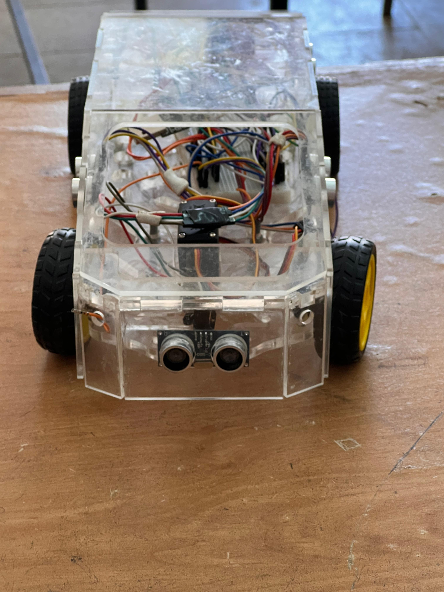
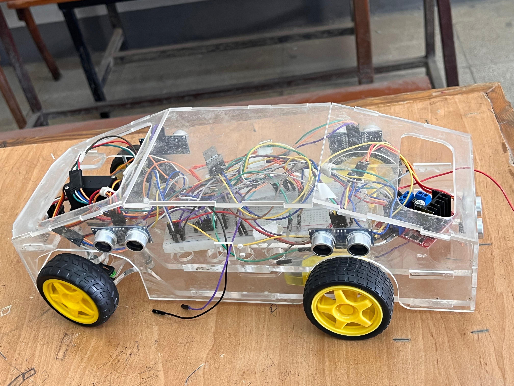

# 🚗 FOTA Graduation Project: Smart Autonomous Car  

  
  
  
  
  

  
  
  

---

**Firmware Over The Air (FOTA) for a Smart Autonomous Car with Voice Assistant & Safety Features**  

This repository contains the **Embedded Systems & FOTA implementation** (my part) of our graduation project: a **Smart Autonomous Car**.  
The full project combined **Embedded Systems, AI Voice Assistant, Autonomous Driving, and IoT**.  

---

## 🔧 My Contribution (Embedded & FOTA)

- 🚦 **Manual Car Control** via UART commands (`W`, `S`, `A`, `D`, `X`)  
- 🛑 **Collision Avoidance System** using ultrasonic sensors  
- 🌡 **Temperature Monitoring** with LM35 sensor  
- 🔄 **FOTA (Firmware Over The Air) Update System** via serial communication (remote firmware upgrade for STM32)  
- ⚙️ **Peripheral Control**  
  - PWM motor driving via H-Bridge  
  - Servo motor steering control  
  - UART communication with external modules  

---

## 🌍 Project Overview (Team Work)

While my focus was on **Embedded Systems & FOTA**, the full project included:  
- 🤖 **Autonomous Driving & Self-Parking** using ultrasonic sensors & control algorithms  
- 🎙 **Voice Assistant Integration** (Google Speech-to-Text → STM32 commands)  
- 🛡 **Safety Features**: Collision avoidance, temperature monitoring, and system health checks  
- 🔗 **System Integration** between AI modules and Embedded hardware  

📄 Check the **Project Poster** → [View Poster](https://drive.google.com/file/d/1MLW1JQC9dWNPqP0EO5JQrVRnjz_HqsGx/view?usp=drive_link)  
📂 Explore the **Full Project** → [Google Drive Folder](https://drive.google.com/drive/folders/1qpWPIhx5iSs9Zaek_k6gIMq2-bLTn5sP)  

---

## 📸 Project Images  

  
  

---

## 📹 Demo Video  

🎥 Watch the demo here:  
👉 [Google Drive Link](https://drive.google.com/file/d/1wGeRly22zoqy-R6mQ1oI05b4wMp8YfYa/view?usp=sharing)  

---

## 🛠 Tools & Technologies  

- **Hardware**: STM32F401, LM35, Ultrasonic Sensors, H-Bridge, Servo Motor  
- **Programming**: Embedded C  
- **Communication Protocols**: UART, PWM, GPIO  
- **AI/Software**: Google Speech-to-Text (Voice Assistant)  
  
---

## 📁 Repository Structure  


```
FOTA_Graduation_Project/
├── Core/
├── Drivers/
├── Inc/
├── Src/
├── FOTA_Manual/
├── a.jpg
├── b.jpg
├── README.md
└── ...
```

---

## 📩 Contact

For any questions or collaborations:  
**Karem Mohamad Abd Elmenam**  
📧 karemheikal1@gmail.com  
[LinkedIn](https://linkedin.com/in/karemheikal)

---

✨ This project was a milestone in my **Embedded Systems journey**, giving me practical experience in:  
- Real-time hardware control  
- Firmware updates over-the-air (FOTA)  
- Integration of embedded systems with AI & IoT solutions  

